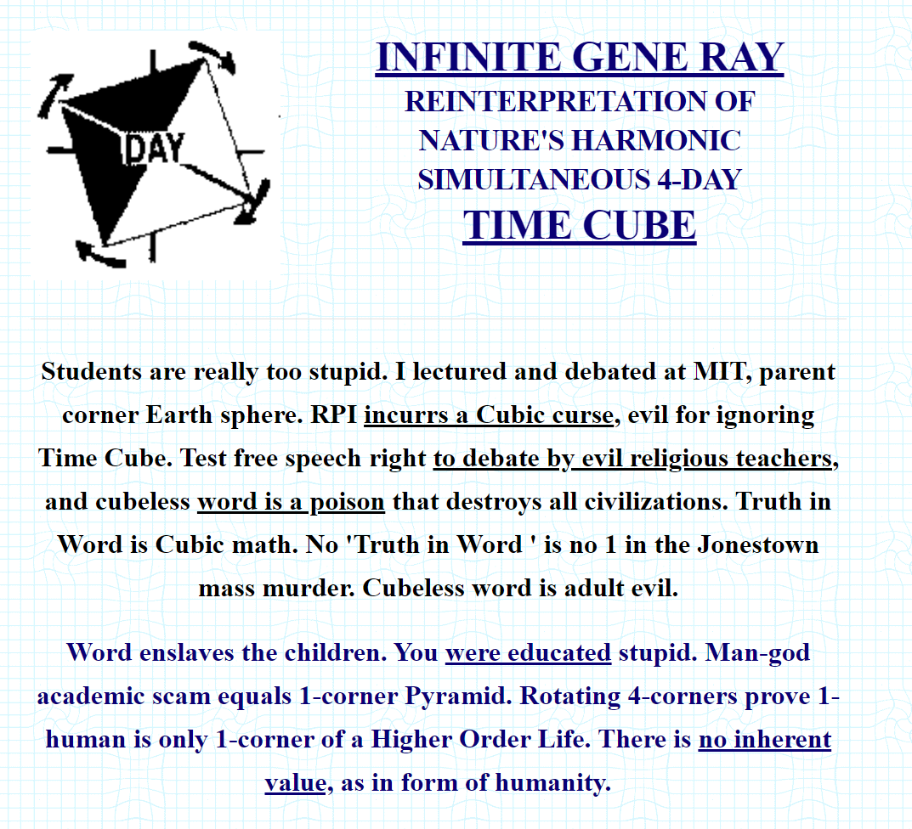

# [INFINITE GENE RAY](https://bennyboy.tech/infinite-gene-ray)



A procedurally-generated website based on [Time Cube](https://timecube.2enp.com). Made for Software Art Spring 2021.

## Context

Time Cube was the brainchild and magnum opus of Otis Eugene "Gene" Ray (1962-2015), self-proclaimed "wisest man on Earth." First launched in 1997, this website espoused Ray's theory of everything, fundamentally based on the presumption that Earth is split into four quadrants of time, and that each day is really four days running simultaneously. Ray goes on to propose wild theories claiming -- among other things -- that modern science is a worldwide conspiracy created to teach lies.

Given the oddly-structured nature of the Time Cube site itself as well as its rambling/incomprehensible writing style, I felt it would be interesting to see the website remixed algorithmically.

## How it works

The Time Cube website has undergone several iterations and designs; for the purposes of easier scraping via `BeautifulSoup4`, I opted for [this version](http://web.archive.org/web/20030219072854/http://timecube.com/) since all of the content is contained within easily-accessible `<blockquote>`s. I used `nltk` to tokenize the text and allow for finer variations in wording (e.g.: `"can't" --> "ca" "n't"`).

For this project, I went with a [Markov chain](https://en.wikipedia.org/wiki/Markov_chain) for several reasons:

- Ease of implementation
  - Simplicity
  - No need for external databases, APIs, etc.
- Configurability/customizability
- Personal familiarity

The Markov chain is order 4 by default; this can be increased or decreased within `gen.py` to change the chain's quality of output. The chain is preconstructed and saved to `js/chain_data.js`.

Using the previously created chain, we can now generate text that hopefully resembles the original Time Cube text.

Simplified explanation:

```
  a b c a c d b

        |
        |
        V

      a -> [b c]
    a b -> [c  ]
      b -> [c  ]
  a b c -> [a  ]
    b c -> [a  ]
      c -> [a d]
a b c a -> [c  ]
  b c a -> [c  ]
    c a -> [c  ]
b c a c -> [d  ]
  c a c -> [d  ]
    a c -> [d  ]
c a c d -> [b  ]
  a c d -> [b  ]
    c d -> [b  ]
      d -> [b  ]

        |
        |
        V

E.g.: a c d b c ...
```

## Comparisons

As with most Markov chain-based text projects, the generated content can be somewhat hit-or-miss. But when the algorithm hits, it most definitely hits hard. Some noteworthy quotes:

> Media will eat dung before a Time Cube.
> Students are really stupid, and she said it was "nutty" and ignore the Time Cube.
> Adult word god is but an evil scam that crucifies children.
> One day, vines will cover New York like old Trojan Horse filled with deadly deception.
> Explain the physics of Santa Claus.

The odd beauty about this project is that oftentimes, the generated content is as unintelligible as the original content.
